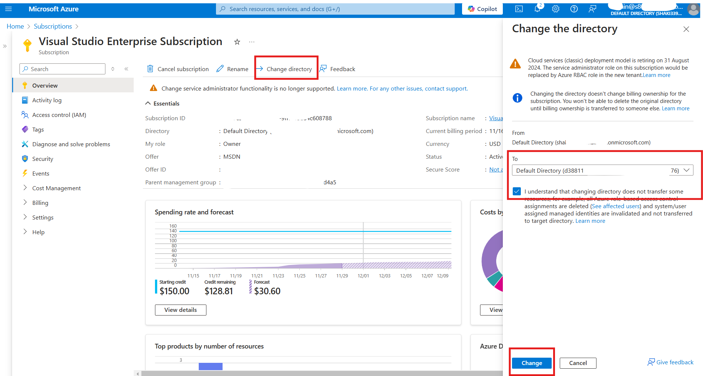

### If you encounter an issue where your tenant name is more than 15 chars long, then:
1. signup on https://outlook.com and create a NEW account that has **as less chars as possible (!)**
1. after signing up, go to https://signup.azure.com using the new account to create a new Entra tenant (choose PAY AS YOU GO and enter credit cart, don't worry it's not gonna be used)
1. Follow this [video quick guide](openNewTenant.zip) to allow access to the azure subscription from your new tenant (PM me for the password)
1. Transfer ownership of the subscription to the new tenant:
    
1. Go [here](https://portal.azure.com/?feature.msaljs=true#view/Microsoft_AAD_IAM/DirectorySwitchBlade/subtitle/), choose the new tenant and click "*Switch*"
