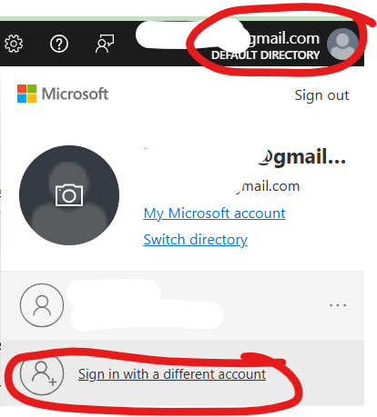
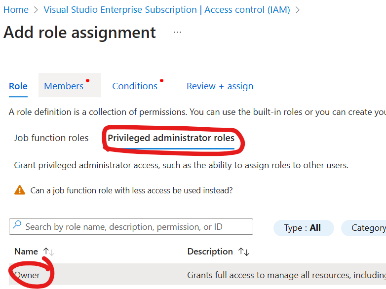

### 1. Entra Tenant + Azure Prep
1. **Azure subscription**: [activate your free 150$ Azure credits](https://my.visualstudio.com/Benefits) (put in your personal Microsoft account), this will be used to deploy the Azure template and host the VMs

2. **Entra tenant**: 
    1. create a new admin user for the Entra tenant: login to [Entra portal](https://entra.microsoft.com/#view/Microsoft_AAD_UsersAndTenants/UserManagementMenuBlade/~/AllUsers/menuId/), and create a new user: 

    2. under *Assignments* > add *Hybrid Identity Administrator* and *Global Administrator* and save: 
     

    3. verify by signing in using the new account and finishing MFA setup: 

    4. keep these creds, *we'll refer to them as **"ENTRA CREDS"***

3. **Enable Azure subscription management** using your **new Entra admin account**: 
    1. sign into [Azure portal](https://portal.azure.com/#view/Microsoft_AAD_IAM/ActiveDirectoryMenuBlade/~/Properties) (if link doesn't work, look inside for "Entra") and turn on the following toggle: 
         

    2. Refresh browser, search and select your subscription > *IAM > Add role assignment*:
    
    *Privileged administrator roles > Owner*:
    
    Next, select your new Entra admin user:
    
    
    Next, select *Allow user to assign all roles (highly privileged)*

    Then, Click *Review and assign* and finish the process.