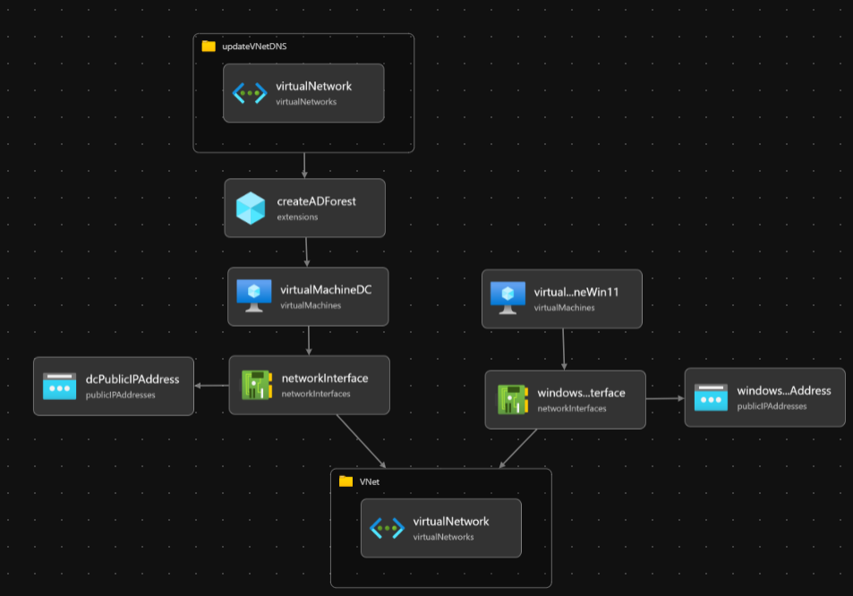
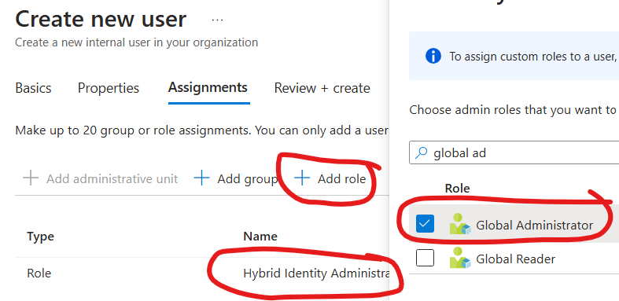
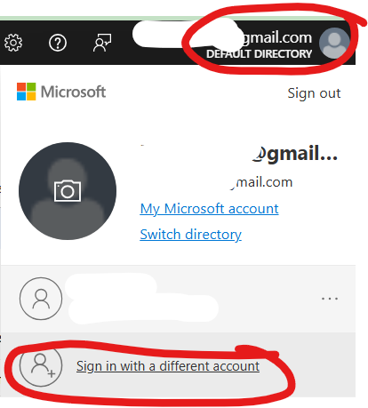
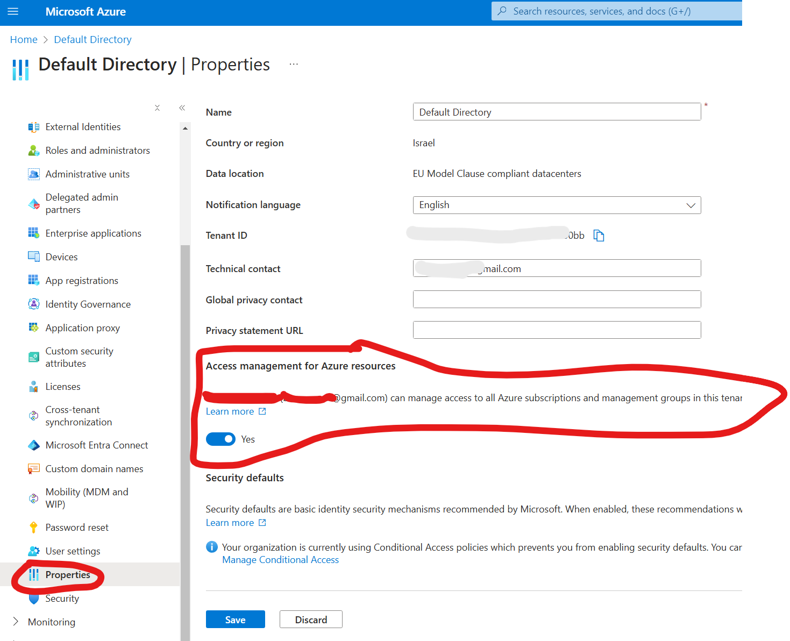
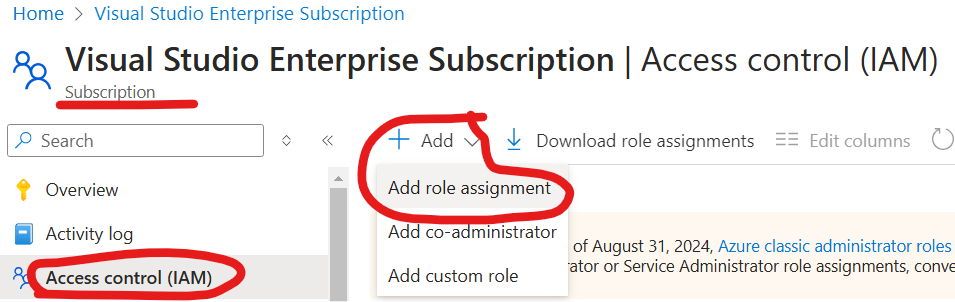
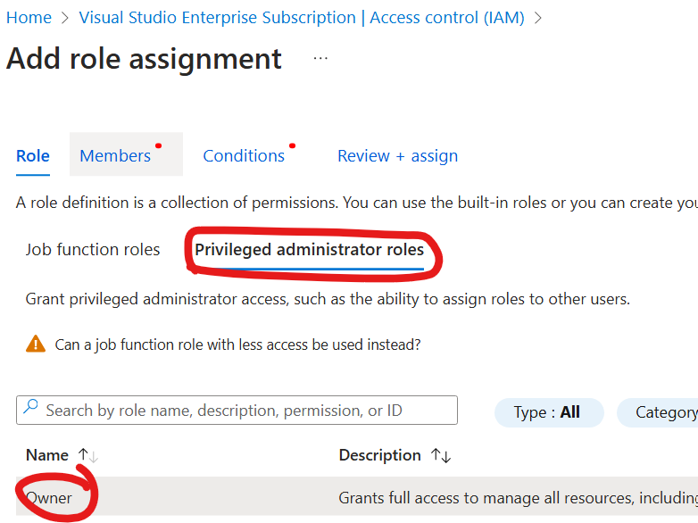
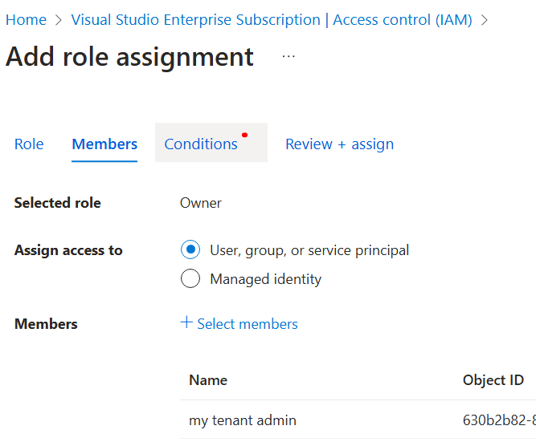
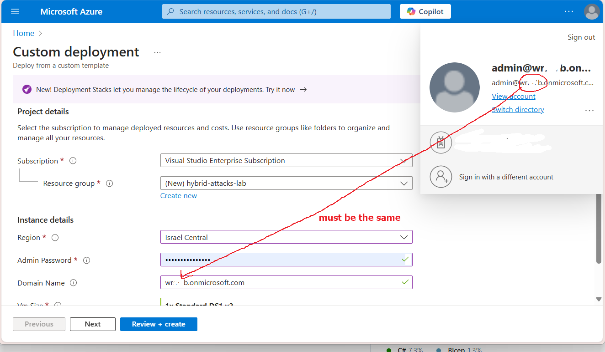
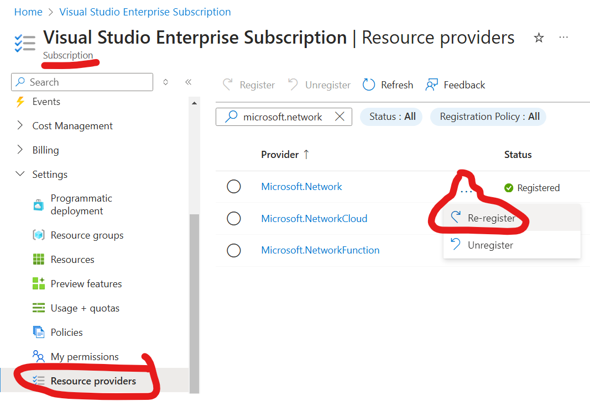
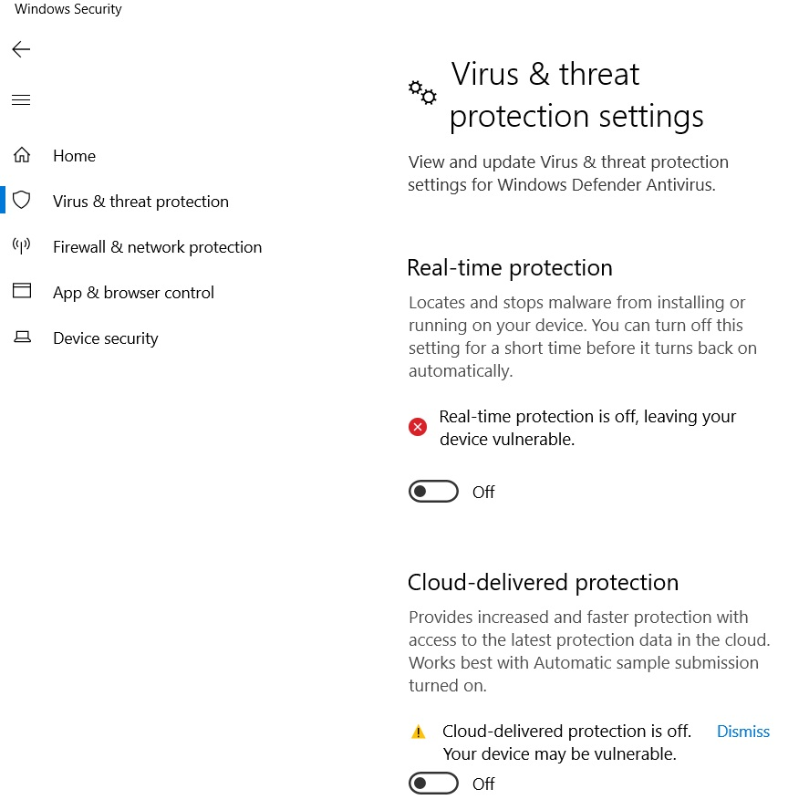

# Preparation instructions for hybrid lab deployment 
#### The lab is comprised from an Active Directory domain + VMs, synced to an Entra tenant, hosted on Azure VMs


* 2 VMs: 
    1. Windows Server 2019 - as a Domain Controller - **dcVm** 
    2. Windows 11 - as a client in the domain
* Creates 40 dummy domain users and adds them to the Domain Admins group.
* the Active Directory domain will be set to the one you set during the deployment
* Common Tasks:
    * Module Installation: PowerShell modules to install (Microsoft.Graph, 
    * DSInternals, AzureAD, AADInternals).
    * Installs various software including Azure AD Connect, Azure CLI, Fiddler, * Python, Mimikatz, Sysinternals Suite, and OneDrive.
    * Disables antivirus using a script.
    * Enables multiple, parallel RDP connections.
    * Enables TLS 1.2 for Windows Server.
    * Disables Internet Explorer Enhanced Security Configuration (ESC).
    * Creates a file on the desktop indicating the script has finished.
    * Restarts the computer to apply changes.

**As part of the lab setup, you will:**
* Create an Entra tenant - which will play the "cloud" role
* Deploy Azure template to your subscription account, this will only be used to host the "On-premise" Active Directory VMs
* Install and confiugre Entra (AD) Connect

### AD Creds:
```
* domain: YOURDOMAIN.onmicrosoft.com
* user: rootuser
* password: CHOSEN AT DEPLOYMENT TIME, follow instructions
```

# Instructions 
* Use only your **personal** Microsoft account (not coroporate/work)

### 1. Entra Tenant + Azure Prep
1. **Azure subscription**: [activate your free 150$ Azure credits](https://my.visualstudio.com/Benefits) (put in your personal Microsoft account, such as *yourname@outlook.com*), this will be used to deploy the Azure template and host the VMs

2. **Entra tenant**: 
    1. create a new admin user for the Entra tenant: login to [Entra portal](https://entra.microsoft.com/#view/Microsoft_AAD_UsersAndTenants/UserManagementMenuBlade/~/AllUsers/menuId/), and create a new user: 

        

    2. under *Assignments* > add *Hybrid Identity Administrator* and *Global Administrator* > *Save > Review > Create*: 

        

    3. verify by signing in using the new account and finishing MFA setup:
    
        

    4. keep these credentials, *we'll refer to them as **"ENTRA CREDS"***

    5. get your domain name (***YOURDOMAIN.onmicrosoft.com***): using your new ENTRA CREDS, find your domain [here](https://admin.microsoft.com/#/Domains)

3. **Enable Azure subscription management** using your **new Entra admin account**: 
    1. sign into [Azure portal](https://portal.azure.com/#view/Microsoft_AAD_IAM/ActiveDirectoryMenuBlade/~/Properties) (if link doesn't work, inside the Azure portal search for "Entra ID") and turn on the following toggle: 
        * make sure you are logged in with the correct, new Entra admin account (!)
        

        * if the toggle is disabled, it probably means that you don't have any Azure subscription associated to your Entra tenant. If this is the case- go back and create another Entra admin account, this time in the CORRECT Entra tenant directory, that has an associated subscription.
    2. Refresh browser, find your subscription > *IAM > Add role assignment*:

        

        *Privileged administrator roles > Owner*:

        

        Next, select your new Entra admin user:

        

    
        Next, select *Allow user to assign all roles (highly privileged)*
        Then, Click *Review and assign* and finish the process.

        **From this point on, you will this Entra admin account for the rest of the actions involving Entra / Azure**

##
### 2. Deploy Azure VMs - "On premise" Active Directory VMs
This part will deploy and configure an active directory domain with two VMs: a Domain Controller ("dcVm") and Win11 VM

Using your new Entra tenant's admin account, click here and follow instructions below:

[](https://portal.azure.com/#create/Microsoft.Template/uri/https%3A%2F%2Fraw.githubusercontent.com%2Fshackcrack007%2Fhybrid-attacks-course-template%2Fmain%2Fmain.json)

1. **Create a resource group:** where all the lab resources will be created
    * you may use *Israel Central* region, if something fails switch to US East 2

2. **Choose a password:** this password will be used for all Active Directory users + VMs (*we'll refer to them as **"AD CREDS"***)

4. **Choose a domain name:** it MUST be the same as your Entra tenant! (you can find it [here](https://entra.microsoft.com/#view/Microsoft_AAD_IAM/TenantOverview.ReactView))
    

5. **Choose VM Size**: if not auto filled you may choose the cheapest one: 1x Standard DS1 v2, 1 vcpu, 3.5 GB memory

6. **Deploy**: wait until it finishes
    * if the deployment fails again, you might need to re-register a provider: 
        Search for your subscription > **Resource providers** > look for **Microsoft.Network** and select **Re-register**: 
    
        
    
    * Alternatively, try Copilot error diagnose inside Azure, it's usually very helpful

##
### 3. Prepare VMs
Once deployment has finished (will take a while..), do the following for **each VM, starting with dcVm**:
1. RDP (**to dcVm first**), using **```rootuser```** and your chosen password (you may find the IP address in the *Azure portal > Virtual machines*)

2. **Disable BOTH the Defender runtime protection AND cloud delivered protection** under *Virus and threat protection > Manage settings*:

    

3. Open Powershell **as administrator** and run the script:
    * modify ***CHANGEME*** to your chosen password from the deployment ("AD CREDS")
    * modify ***YOURDOMAIN*** to your Entra tenant domain
    * if you see a pop up suggesting you to restart, WAIT until all scripts finish executio
    * the script should restart the VM when it finishes

    ```powershell 
    Set-ExecutionPolicy -ExecutionPolicy Unrestricted -Scope Process -Force

    Invoke-WebRequest -Uri "https://raw.githubusercontent.com/shackcrack007/hybrid-attacks-course-template/main/prepareVM.ps1" -OutFile "C:\\prepareVM.ps1"; `
    & "C:\\prepareVM.ps1" `
    -DomainUser rootuser `
    -DomainPassword CHANGEME `
    -DomainName YOURDOMAIN.onmicrosoft.com # the one listed here https://admin.microsoft.com/#/Domains
    ```

4. repeat 1-3 for the **other VM**

* you might see errors here and there - ignore them

5. **Verification:**
    1. RDP to each VM using your **```YOURDOMAIN\user1```** and your chosen password
    2. look at c:\lab\LabSetupResults.txt and make sure all is installed properly, if something isn't then manually install it
    3. turn off the VMs, see you when the course starts!

### 4. Prepare local machine (PC / laptop)

Open Powershell as administrator and run:
```powershell 
if (-not (Get-Module -ListAvailable -Name Az)) {
    Write-Verbose "Installing Az module, this wil take a few mins..."
    Install-Module -Name Az -Force -AllowClobber -Verbose
}
if (-not (Get-Module -ListAvailable -Name Microsoft.Graph)) {
    Write-Verbose "Installing Microsoft.Graph module, this wil take a few mins..."
    Install-Module -Name Microsoft.Graph -Force -AllowClobber -Verbose
}
```