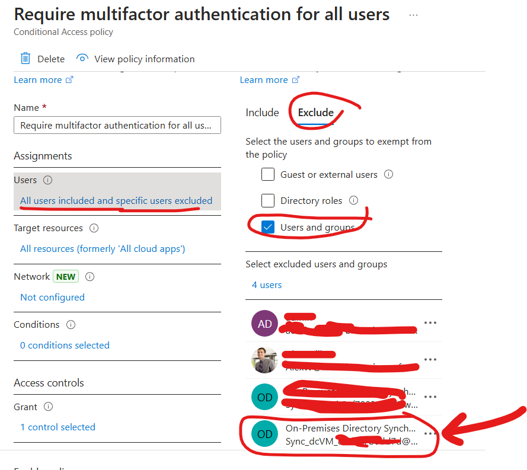
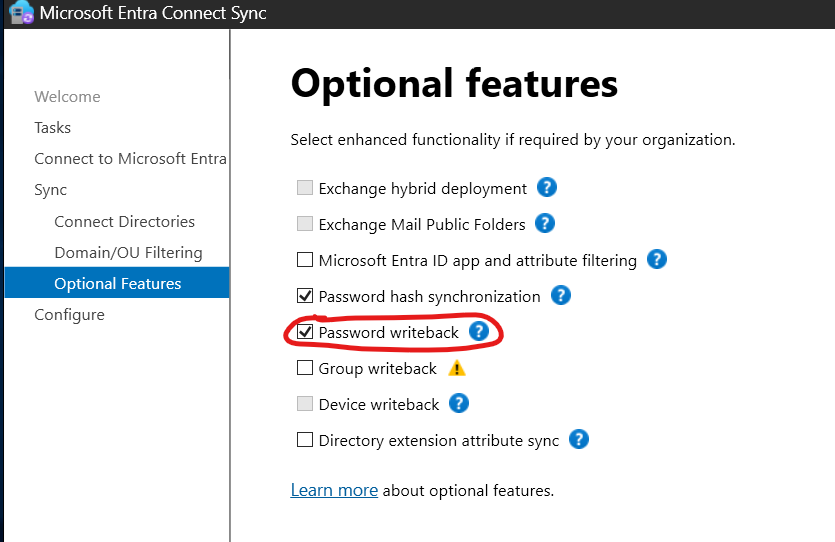

# Create an Azure VM with a new AD domain

This template will deploy a lab for the course: a new VM (along with a new VNet ) and will configure it as a Domain Controller and create a new forest and domain + win11 vm

As part of the lab setup, you will:
* Create an Entra tenant - which will play the "cloud" role
* Deploy Azure template to your subscription account, this will only be used to host the "On-premise" Active Directory VMs
* Install and confiugre Entra (AD) Connect

### AD Creds:
```
* domain: mylab.local
* user: rootuser
* password: CHOSEN AT DEPLOYMENT TIME, follow instructions
```

# Instructions 
### 1. Entra Tenant + Azure Prep
1. **Entra tenant**: go to https://developer.microsoft.com/en-us/microsoft-365/profile?source=visualstudio and activate your M365 E5 account and then login, keep the admin credentials, these will be your **"ENTRA CREDS"**
2. **Azure subscription**: activate your free 150$ Azure credits https://my.visualstudio.com/Benefits (put in your personal Microsoft account), this will only be used to deploy the Azure template and host the VMs

### 2. Deploy Azure VMs - "On premise" Active Directory VMs
1. reate a resource group where all the lab resources will be created  
2. in your **personal** Azure subscription click here: [](https://portal.azure.com/#create/Microsoft.Template/uri/https%3A%2F%2Fraw.githubusercontent.com%2Fshackcrack007%2Fhybrid-attacks-course-template%2Fmain%2Fmain.json)
3. remember and keep the password- it will be your **"AD CREDS"** 

### 3. Prepare VMs
Once deployment is finished, do the following for each VM:
1. RDP to using 'rootuser' and your chosen password 
2. **disable the Defender runtime protection and cloud delivered protection** (under *Virus and threat protection > Manage settings*)

3. Open Powershell as administrator and run the script (ignore the errors), use your chosen password:
```powershell 
Set-ExecutionPolicy -ExecutionPolicy Unrestricted -Scope Process -Force

Invoke-WebRequest -Uri "https://raw.githubusercontent.com/shackcrack007/hybrid-attacks-course-template/main/prepareVM.ps1" -OutFile "C:\\prepareVM.ps1"; & "C:\\prepareVM.ps1" -DomainUser rootuser -DomainPassword CHANGEME -DomainName mylab.local
```

### 4. Entra Connect configurations
Prepare your Entra + AD creds:
1. on the DC VM, install "AzureADConnect.msi" from your dekstop and then run it
2. If you encounter an error where it cannot resolve a domain, then open Internet Explorer and Edge and browse to google
3. follow setup
4. if you encounter another unknown error, it's probably due to MFA enforced (AD Connect must have an exclusion):
    1. in https://entra.microsoft.com/#view/Microsoft_AAD_ConditionalAccess/ConditionalAccessBlade/~/Policies/fromNav/ look for "***Require multifactor authentication for all users***" policy, and add an exlclusion like this to the "Sync" user, and save the policy: 

5. Configure > "Customize synchronization options" > check "password writeback"  and finish setup

6.  Configure > "Configure device options" > "Configure Hybrid Microsoft Entra ID join" > check "Windows 10 or later".. > select "mylab" and click Add and enter your AD Creds > select Authentication service "Entra ID" > click Configure