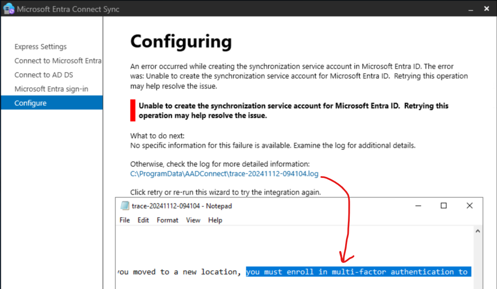
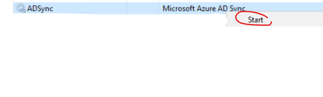
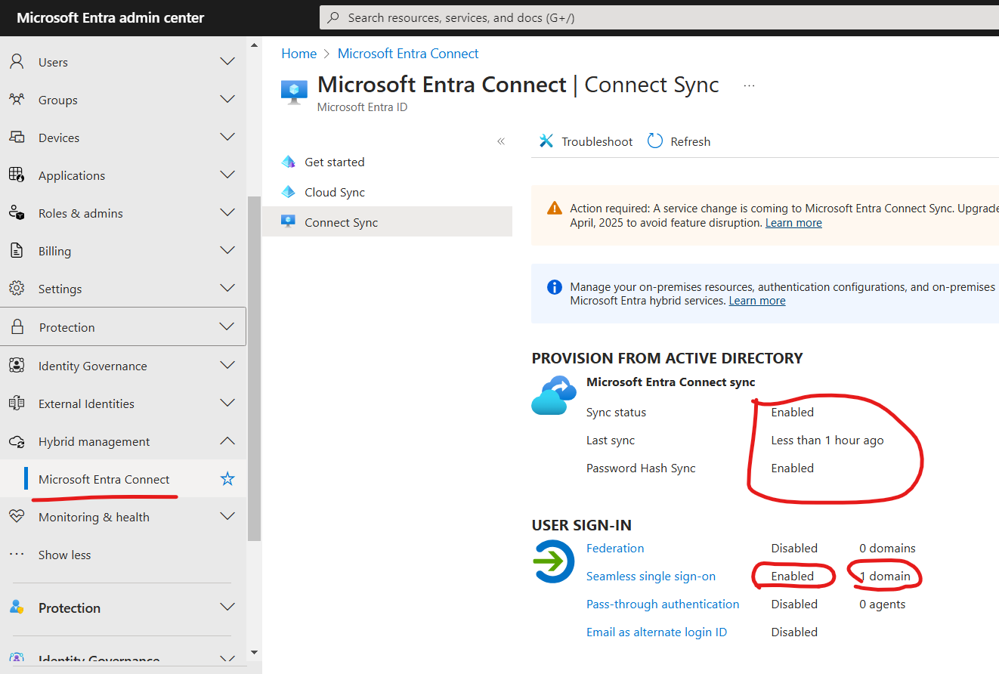
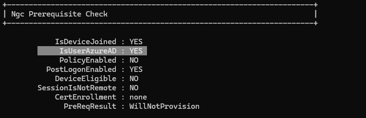

# Lab 1 - Entra Connect Setup
In this lab you will setup and configure Entra Connect, which will sync up your active directory users and computers to Entra.
The configurations will include "password writeback", supporting Hybrid device join, and turning on Seamless SSO.
Prepare your Entra + AD admin credentials:
1. on the DC VM, install "c:\lab\AzureADConnect.msi"
1. run *"Azure AD Connect"* and use the Express Installation
1. First use your Entra credentials *YOURUSER@YOURDOMAIN.onmicrosoft.com*
1. Next, use your AD credentials *YOURDOMAIN.onmicrosoft.com\rootuser*
1. Check the "Continue without matching"... boxthu
1. Install

    * If you encounter an error where it cannot resolve a domain, then open Internet Explorer and Edge and browse to google
    * if you encounter this error, it's due to MFA enforced (Entra Connect account (*Sync_xx..*) must have an **exclusion**):

        

        See [here](pics/https://entra.microsoft.com/#view/Microsoft_AAD_ConditionalAccess/ConditionalAccessBlade/~/Policies/fromNav/) "***Require multifactor authentication for all users***" policy,   
        and add an exclusion to the "*Sync*" user, and save the policy: 

        

    and Retry.
1. Once done, run it again > *Configure > Customize synchronization options > Optional Features* > check *password writeback* and finish the config: 

    

4. run it again > *Configure > ***Change user sign-in*** >  check *Enable single sign-on*.. > *Next* > Enter your **AD CREDS** > *Next > Configure*

5. run it again > *Configure > ***Configure device options*** > Configure Hybrid Microsoft Entra ID join* > check *Windows 10 or later*.. > select *YOURDOMAIN.onmicrosoft.com* > *Add* and enter your **AD Creds** > select Authentication service *Entra ID* > *Next > Configure*

6. GPO:
    1. follow  [Group policy detailed steps
](https://learn.microsoft.com/en-us/entra/identity/hybrid/connect/how-to-connect-sso-quick-start#group-policy-detailed-steps) instructions 
    2. run ```gpupdate /force``` 

6. restart the VMs

7. login to the **dcVm** > Open Task Manager > look for "```ADsync```" and start it if it's not running

    
    
8. Force Entra Conncet sync by running on **dcVm**:
    ```powershell
    Import-Module ADSync
    Start-ADSyncSyncCycle -PolicyType Initial
    Get-ADSyncConnectorRunStatus # wait for it to finish (should return empty result)
    ```

### Verify
1. go to https://entra.microsoft.com/#view/Microsoft_AAD_Devices/DevicesMenuBlade/~/Devices/menuId/Overview and look for your onboarded devices, they should be listed as "*Microsoft Entra hybrid joined*" under the "*Join type*" column (it takes time for the "Registered: Pending" state to finish)
    * If you don't have the two VMs in the "Devices" tab in entra portal:
        1. login to win11 using yourdomain\user1
        1. run this tool on the dcvm: https://learn.microsoft.com/en-us/samples/azure-samples/dsregtool/dsregtool/
        1. restart dcvm and rdp login again
        1. wait at least an hour (keep the VMs turned on), and check again
    * Only after you see the VMs in the Devices tab, continue

2. go to https://entra.microsoft.com/#view/Microsoft_AAD_UsersAndTenants/UserManagementMenuBlade/~/AllUsers/menuId/ and look for users 1-5, they should be listed as "*Yes*" under the "*On-premise sync enabled*" column

3. go to https://entra.microsoft.com/#view/Microsoft_AAD_Connect_Provisioning/AADConnectMenuBlade/~/ConnectSync and look for the following values: 
    

4. Following your device Registration completion [(see *Registration* column here)](https://entra.microsoft.com/#view/Microsoft_AAD_Devices/DevicesMenuBlade/~/Devices/menuId/Overview), RDP to the Win11 VM as "``YOURDOMAIN\user1``":
    1. open CMD as Administrator and run: ```dsregcmd /status```, you should see similar output to:
        

        and

        
    2. if you don't see one of them, make sure:
        - ADSync service is running on the DC, and restart
        - [*Registered* column is not "Pending"](https://entra.microsoft.com/#view/Microsoft_AAD_Devices/DevicesMenuBlade/~/Devices/menuId/), if it is, then continue to the next lab