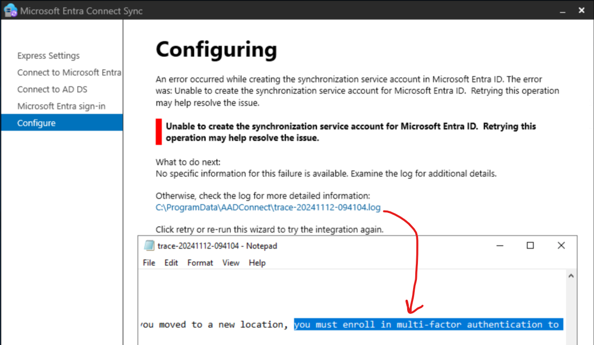
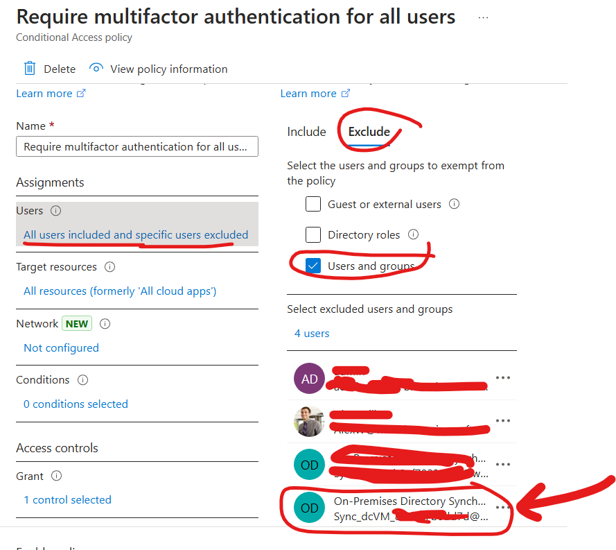
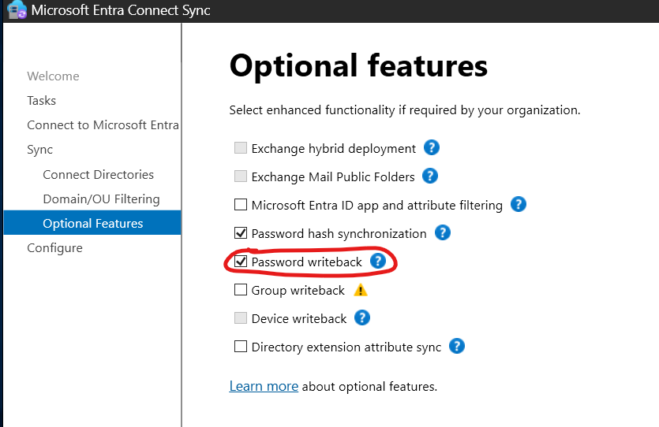
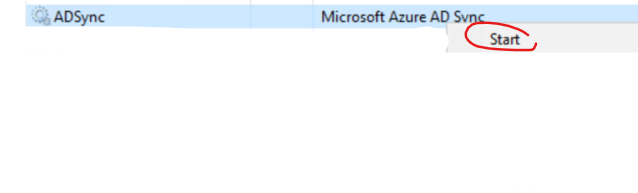
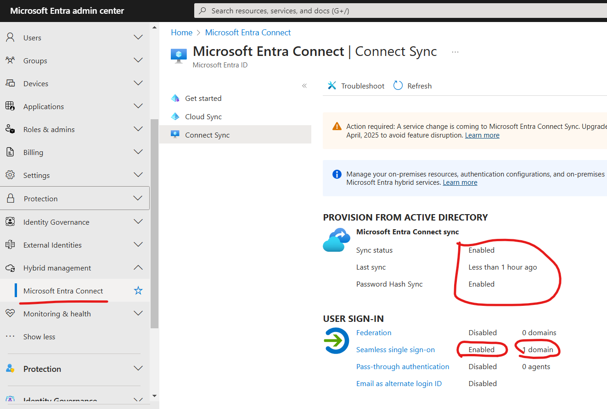
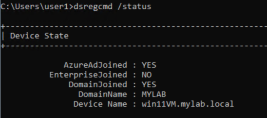
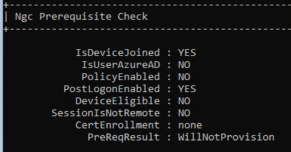

# Lab 1 - Entra Connect Setup
In this lab you will setup and configure Entra Connect, which will sync up your active directory users and computers to Entra.
The configurations will include "password writeback", supporting Hybrid device join, and turning on Seamless SSO.
Prepare your Entra + AD admin credentials:
1. on the DC VM, install "c:\lab\AzureADConnect.msi"

2. run *"Azure AD Connect"* and use the Express Installation
    1. First use your Entra credentials *YOURUSER@onmicrosoft.com*
    1. Next, use your AD credentials *YOURDOMAIN.onmicrosoft.com\rootuser*
    1. Check the "Continue without matching"... box
    * If you encounter an error where it cannot resolve a domain, then open Internet Explorer and Edge and browse to google
    * if you encounter this error, it's due to MFA enforced (Entra Connect account (*Sync_xx..*) must have an **exclusion**):

        

        [here](https://entra.microsoft.com/#view/Microsoft_AAD_ConditionalAccess/ConditionalAccessBlade/~/Policies/fromNav/) look for "***Require multifactor authentication for all users***" policy, 
        
        and add an exclusion to the "*Sync*" user, and save the policy: 

        

        and Retry.
3. Once done, run it again > *Configure > Customize synchronization options > Optional Features* > check *password writeback* and finish the config: 
    

4. run it again > *Configure > Change user sign-in >  check *Enable single sign-on*.. > *Next* > Enter **AD CREDS** > *Next > Configure*

5. run it again > *Configure > Configure device options > Configure Hybrid Microsoft Entra ID join* > check *Windows 10 or later*.. > select *YOURDOMAIN.onmicrosoft.com* > *Add* and enter your **AD Creds** > select Authentication service *Entra ID* >  *Next > Configure*

6. GPO:
    1. follow  [Group policy detailed steps
](https://learn.microsoft.com/en-us/entra/identity/hybrid/connect/how-to-connect-sso-quick-start#group-policy-detailed-steps) instructions 
    2. run ```gpupdate /force``` 

6. restart the VMs

7. login to the DC VM > Open Task Manager > look for "ADsync" start it if it's not running



### Verify
1. go to https://entra.microsoft.com/#view/Microsoft_AAD_Devices/DevicesMenuBlade/~/Devices/menuId/Overview and look for your onboarded devices, they should be listed as "Microsoft Entra hybrid joined" under the "Join type" column 
    it takes time for the "Pending" state to finish

2. go to https://entra.microsoft.com/#view/Microsoft_AAD_UsersAndTenants/UserManagementMenuBlade/~/AllUsers/menuId/ and look for users1-40, they should be listed as "Yes" under the "On-premise sync enabled" column

3. go to https://entra.microsoft.com/#view/Microsoft_AAD_Connect_Provisioning/AADConnectMenuBlade/~/ConnectSync and look for the following values: 
    

4. After a restart, in your Win11 VM, RDP login as "*YOURDOMAIN\user1*":
    1. open CMD as Administrator and run: ```dsregcmd /status```, you should see similar output to:
        

        and 

        
    2. if you don't see one of them, make sure ADSync service is running on the DC, and restart