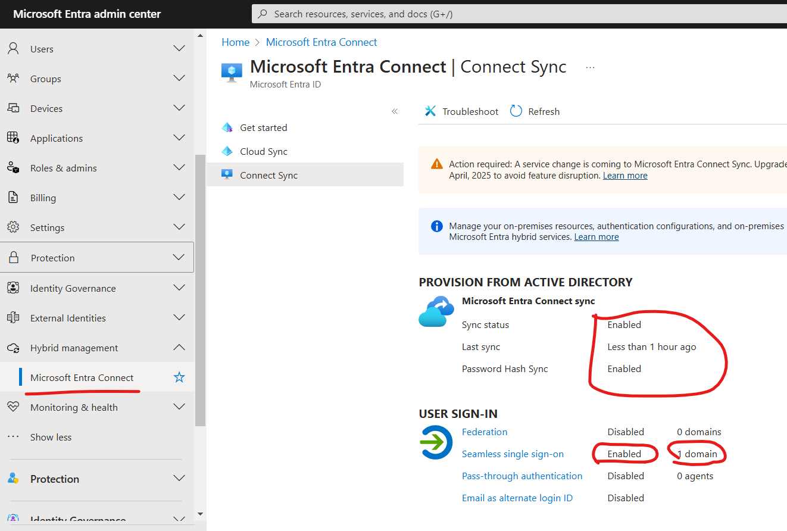
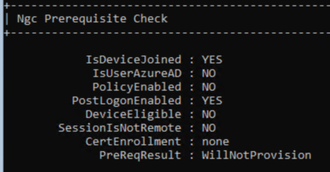

# Entra Connect configurations #
Prepare your Entra + AD admins creds:
1. on the DC VM, install "AzureADConnect.msi" from your dekstop and finish setup
    * If you encounter an error where it cannot resolve a domain, then open Internet Explorer and Edge and browse to google
    * if you encounter another unknown error, it's probably due to MFA enforced (AD Connect must have an exclusion):
    [here](https://entra.microsoft.com/#view/Microsoft_AAD_ConditionalAccess/ConditionalAccessBlade/~/Policies/fromNav/) look for "***Require multifactor authentication for all users***" policy, and add an exlclusion like this to the "Sync" user, and save the policy: 

2. run *"Azure AD Connect"* and use the express installation

3. run it again > *Configure > Customize synchronization options > Optional Features >* check *password writeback* and finish the config: 

4. run it again > *Configure > Change user sign-in >  check *Enable single sign-on*.. > *Next* > Enter **AD CREDS** > *Next > Configure*

5. run it again > *Configure > Configure device options > Configure Hybrid Microsoft Entra ID join* > check *Windows 10 or later*.. > select *YOURDOMAIN.onmicrosoft.com* > *Add* and enter your **AD Creds** > select Authentication service *Entra ID* >  *Next > Configure*

6. GPO:
    1. follow  [Group policy detailed steps
](https://learn.microsoft.com/en-us/entra/identity/hybrid/connect/how-to-connect-sso-quick-start#group-policy-detailed-steps) instructions 
    2. run ```gpupdate /force``` 

6. restart the VMs

### Verify
1. go to https://entra.microsoft.com/#view/Microsoft_AAD_Devices/DevicesMenuBlade/~/Devices/menuId/Overview and look for your onboarded devices, they should be listed as "Microsoft Entra hybrid joined" under the "Join type" column

2. go to https://entra.microsoft.com/#view/Microsoft_AAD_UsersAndTenants/UserManagementMenuBlade/~/AllUsers/menuId/ and look for users1-40, they should be listed as "Yes" under the "On-premise sync enabled" column

3. go to https://entra.microsoft.com/#view/Microsoft_AAD_Connect_Provisioning/AADConnectMenuBlade/~/ConnectSync and look for the following values: 

    

4. After a restart, in your Win11 VM, RDP login as "*YOURDOMAIN\user1*":
    1. open CMD as Administrator and run:
        ```
        dsregcmd /status
        ```
        you should see similar output to:

        
        
        and 

        